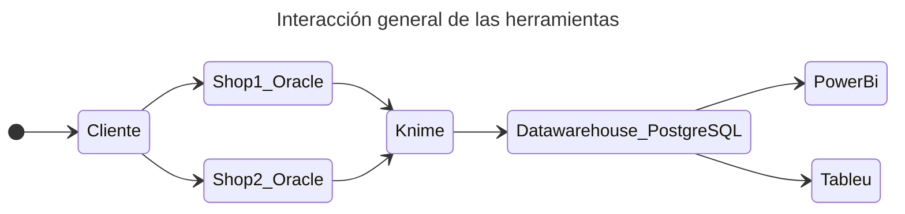

# Proyecto 3 - DB

<h5 align = "center">Hecho con</h5>

<img align="center" alt="Java" width="70px" style="padding-right:20px;" src="data:image/jpeg;base64,/9j/4AAQSkZJRgABAQAAAQABAAD/2wCEAAkGBw0NDQ0ODQ4PDQ0PEBIQDw0NDxANDg0NFh0iFhUdExMkKDQgGBolHh8YIjEhJSkuLi4vGB81ODYtOCgtMCsBCgoKDg0OGxAPFisdHiEtLS0vNy4sNzctMCsuNystKyswLS0tNy0uLSsuLi8rKysxMis1ListLS8tMjAtOC0tK//AABEIAKgBLAMBEQACEQEDEQH/xAAbAAEAAgMBAQAAAAAAAAAAAAAAAQUEBgcDAv/EAEYQAAIBAwEDBQsICQMFAAAAAAABAgMEEQUGEiEHEzFBcRQVIjM0UXOBgrHRIzJSYXKRorIIFkJTY3SSocEkNaM2YoOEs//EABsBAQACAwEBAAAAAAAAAAAAAAABBAMFBgIH/8QANBEBAAECAwQHBgYDAAAAAAAAAAECAwQRcQUyMzQUFVFSgaHREjFBYZGxEyEiU+HwBiPB/9oADAMBAAIRAxEAPwDuIAAAAAAAAAAAAAAAAAAAAAGPqF2qFKdRrO70LozJ8EVsXiYw9mq7VGeX9hls2pu1xTDWJbS3OeCppebdfD+5y0/5Bic/yin6T6ttGzrXzR+slz/D/pfxI6/xXZT9P5Or7XzR+stz/D/pfxJ6/wAV2U/T+U9X2fmfrLc/w/6X8R1/iuyn6fydX2vmmntPcJpyjTlHrWHFtfU88D1R/kGIif1U0zH9+aKtnWpj8pmG2W1aNWnCpH5s4qSz04fnOstXIu0RXT7pjNpq6Joqmmfg9DI8gAAAAAAAAAAAAAAAAAAAAAAAAAAAAAAAAAAKnafyWX2o+81O2+Tq8PuuYDjR4tMOHb4yBGSRAEAb9onktD7CPoOz+Vt6Q53FcarVnFxXAAAAAAAAAAAAAAAAAAAAAAAAAAAAAAAAAAAVO1Hkk/tQ95qdt8nV4fdcwHGjxaVk4hvgCAIySIyEugaH5JQ+wj6Bs/lbekOcxXGq1ZxcVwAAAAAAAAAAAAAAAAAAAAAAAAAAAAAAAAAAFRtS/wDST+1D3mq21ydXh913AcaPFpO8cRk3yMgMkgBGQOgaF5Jb/YR3+z+Vt6Q5zFcarVnlxXAAAAAAAAAAAAAAAAAAAAAAAAAAAAAAADCvtQVJ7qW9LpfHCRqsftOMNV7FNPtT9lmzh/bjOZyhid+J/Qj97Nf17c/bj6s3Q6e1Hfif0I/eyOvrn7cfU6HT2sTU7t3NJ0pJQTae9Hi+HErYvatWItTbmiIz+bNYsRar9qJzU3eqP05fcjT5QvfjT2MW9snSW8pb0c4eVhoiaWSi57X5SxsnhkCRGQOhaF5Jb/YR32z+Wt6Q5zFcarVnlxXAAAAAAAAAAAAAAAAAAAAAAAAAAAAAAACg1Xx0/V7jjtr83V4faG0w3DhhmsWEECMkJQ2Qlhau/kJ9sfzIR73u3vQqE+CPC0ARkkdE0HyS39GjvcBy1vSHOYrjVas8uK4AAAAAAAAAAAAAAAAAAAAAAAAAAAAAAAa/q3j5+z7jjdr83V4faG1w3DhhZNWsIbIzShsjMfOSM0sPWPJ59sPzI9Ue97t7yoi+C7DzKyZAjJKXRdA8jt/Ro73Actb0hzeK41WqwLauAAAAAAAAAAAAAAAAAAAAAAAAAAAAAAAGu6u/l5+z7ji9sc3V4faG2wvChhNmrzWHzkjNIQlDYGFq7/08+2P5keqN57o3lQnwXYJWQASOjaB5Hb+jR3mA5a3pDm8VxqtVgW1cAAAAAAAAAAAAAAAAAAAAAAAAAACG8cX0ETMRGcjElqEc8Itrz9Bq6tq0RP6aZlYjDz8ZR3wX0X95HWtPc809H+Z3wX0X9461p7nmdH+asvafO1JTT3c44dPQsGixtPSL03I/LPJctVfh0RSx3Zv6S+4qThJ7zJ+NHYxppxbT6UVKqZpnKWaJzjOHy2eXp8tkZmTC1d/IT9n8yPVveh7o96qj0LsPcrBkCGwOkbP+R2/o0d5gOWo0hzeK41WqwLauAAAAAAAAAAAAAAAAAAAAAAAAAAB43fi59hXxfAr0e7e/CoOXXwAACUZIzFfevw/UjWYqf9ngtWd1jNlXNlQ2RMpYWqv5Cfs/mR6tT+uHun3qtPguwzyzAEZCXStn/I7b0aO7wHLUaQ5rF8arVYFtXAAAAAAAAAAAAAAAAAAAAAAAAAAA8bzxc+wr4vgV6PdvfhUHLtgZIzEEZgRmlGSMxXX78P1I1mLn/Z4LVndYuSrmzZIISxNV8RP2fzIy2d+E0+9VJ8F2FiWYCQDpWz3kdt6NHdYHlqNIc1i+NVqsS2rgAAAAAAAAAAAAAAAAAAAAAAAAAAeN54ufYVsZwK9GS1vwpzls19GSM0mSMxBGaUZIzFdf/P8AUjWYvieC3Z3WMVmVGQMPVX8hP2fzIy2d+Ex71XF8F2FmWcyQIbJHTNnfIrb0aO5wPLUaQ5rF8arVYltXAAAAAAAAAAAAAAAAAAAAAAAAAAA8bzxc+wrYzgV6SyWt+FKcpm2AQlGSMxGSMwPOaVbfvw/UjXYrieC1Z3WNkrsqAliaq/kJ+z+ZGWxvwmFUnwXYWmYAjIS6ds75FbejR3OB5ejSHM4vjVarEtK4AAAAAAAAAAAAAAAAAAAAAAAAAAHhe+Kn2FbG8vXpLJa34UuTkc2xRkjNIRmIIzAjNKtv/n+pGvxG+tWd1jZMDK+cgYmqeIn7PvRmsb8JhVJ8F2FlmAkJHTtnPIrb0aO4wPL0aQ5nF8arVZFpXAAAAAAAAAAAAAAAAAAAAAAAAAAA8L3xU+wq43l69JZLW/CjOPzbIIzSZIzEZIzEZIzSrb9+H6kUsRvrVrdY2TAyoyEsTU/Ez9n3ozWN+BVR6EWpZTIShsDqGzfkVt6NHcYHl6NIczi+NVqsi0rgAAAAAAAAAAAAAAAAAAAAAAAAAAeF94qfYVcdy9ekslnfhRZONzbMyRmIyRmlGSMxGSM0q2/fh+pFO/vLVrdYxhZUZJGLqXiZ+z70ZbG/AqU+CLbNBkCAOpbN+Q23o0dvgeXo0hzOL41WqyLSuAAAAAAAAAAAAAAAAAAAAAAAAAAB8VYKUZRfQ1gx3bcXKJon4xk9U1ezMSp56fVT4JSXnTSOXr2ViaZyinPxj/q/GItz8cnz3BW+h+KPxPHVeL7nnHqnpFvtO99b6H4o/EjqvF9zzj1T0i32o731vofij8SOqsX3POPU6Rb7TvfW+h+KPxHVWL7nnHqdIt9rBvNHuZTzGnlYX7cF/kr3dj4yqrOLfnHqz28XZiMpq8peHeO7/dfjp/E8dS439vzj1ZOm2O95T6HeO7/dfjp/EdS439vzj1Om2O95T6Me+2fvJ0pRjRy3jC5ymutPzmS1sfGU1RM2/OPU6bY73lPor1stqH7j/kpfEsdVYruecerJGPw/e8p9D9VtQ/cf8lL4jqrF9zzj1T0/D97yn0elDZK+lJKVONNdc5VINL1Jtnu3sjE1VZVRlGsf8eatoWIjOJz8HQLG2VCjTpReVTiopvpeOs6m1bi3RFEfCMmhuVzXXNU/F7mR4AAAAAAAAAAAAAAAAAAAAAAAGm8o23L0ONnu2jval1UlTjBVuYw446915bbSxgChuuU/VLWPO3uzN5Qto8alaNZ1eaj52ubS+9oDedltpLTV7SF3ZzcqcnuyjNKNSjUXFxqR6pLK+rimspgW4AAAAAAAAAAAAeVzWVOnUqNZUISm0ulpLIHLNG5WdTv6TrWezla4pKbg50rzeippJteL6cNfeBebJ8plG+vO913aV9L1BpuNvc5am0t7EZYTzjjxisroAv8AbjaHvRptzfqj3Q6HN/Jb/Nb2/ONP52HjG9no6gMvZrVe77G0vOb5ruijCrze9v7m8s43sLPbgCyAAAAAAAAAAAAAAAAAAAAAA5Fy+eN0D+cl76YHWa8oKE3UcVTUW5ueFBQx4W9nhjAHIP0eoeHrtSipKxlcUlb5zu8HUfBPoai6ee1AWEtutY1i8uLfZy3tu5LaThU1G9cnTqT6ubS6E8PHCTaw3u5wB519udc0O5t6e0NvbVLGvLcV/Y7+KUuveXXhcd3dTay1nGALvlT2wvNFp6fdW8KNW0qV+auVOMp1HFrfjzTTSTcY1OLz1Abdq2p07WzuLxtSp0aE6+V+1GMXLh2/5A0rkf28r65RvFdxpQuLepB4oRlCLozT3eDby04y/sBk7UbX3dHXtJ0iyjRk7lc7dSqxlKUaCbb3GmsS3YVHxz+yB97c7b1rK6ttM023jeatdrep06jcaNClx8Ko+GfmyeMrCi22uGQpNY1va7SKLvb2jpl/aU2nXpWbrQrUqb61JpYSeMvEsdOMZaDfLLXKV3pq1C1e9TqW8q1PfXQ0m8TSfSmmmk+lMDl2z/KRr2s0KVvpdrQnfxU53t1UhKnaW1PeapRWXxnJL6+vC4NxDqOy1TUJ2NGWqU6dK+8NVoUWnT4Tag44b6Ybr6evq6EGZqvk1x6Gp+Vgck5BNoNPtNIrU7q9tLao72pJU7i4pUZuDhTSai2njKfH6mA16dPXdq9KnpbVelp3NzvL+j4VBRhPnFDnFwllZSw3xqPzMDbOW7/pvUf/AF//ALUwLXk2/wBi0n+Uo+4DZAAAAAAAAAAAAAAAAAAAAAAOPfpC05TehwjN05SuakY1FxcJPcSa7OkCwqclN7crm9R2j1C7tn86hFSpKfXxzOUX64gbXeaPR0rQ72302lzSpWdzKklmU5V9xtOUumUm8cQNd5AIU1oMHDG9K4rOrjp5zKSz9e6oAenL1Cm9n67njejWoOlnpVTew8fXuuX9wPrW9GqajsdSozUncLTLatHK+UdxSpxqY4/tPDj7TA07Utpp3exVhb03vXd1Wo6Xuxl4W9Tlwy/+6EYZ9IBaadp8NB2utKFPMbTUdPhbx44gq1GKguHXL5KPF8c1X5wMrk8h3y2k17Vnl0qElY2zbzBpYi3HzeDBP/ysChuVqtTbfVFpk7SF1G3gou/5x0lQ3KWVDdTalxT9cgNo1TSNs7u2uLarcaJzVxSqUam6rtS3JxcZYe5weGBc7I7PV9J2edlczp1KtKldNyouUqaU3KaUW0m+nzICj/R6pxWhykopSld1d6SXGWFFLLA6cBi6r5NcehqflYHEuRPYfSdU0yvXv7VXFaF5OlGbq16eKap05JYjJLplL7wPXlK2apbL9x6todSpZt3EaFW1dSpVo1cxlNb2XlrwZJxbfSsYxxDcuWG4VbZW8qpOKqQtJpPpSlVpsC85Nv8AYtJ/lKPuA2QAAAAAAAAAAAAAAAAAAAAADnfK3svfanPR3ZUlVVtcudbNSnT5um3Hj4TWVwfRl/UB0QCJRTTTSaaw0+Ka+sDkdhsxtBs3c3C0WlR1PTLipznclaqqVWg/qcmuKWI7ybykspdQel3sxr20dxQ7+UqOm6Xb1FU7io1VVrXEsY8KUW10OSzlNJvC45A6xGKSSSSSWEksJLsA4js1yaanba7SVWklolpe17y3lz1OUXJpc1iGd/e8GknlYW4+PnDbeWDZa91CjYXGmQ3tQsblVKXh06bUHhtxcmo5Uo03x8z9YWfJVszU0jSKNvXgoXU5TrXEYyU0qsnhLeXBtQUFw4cAKrb3Yy/qahb61otWnT1GhHcq0a3CndUllLj58PdaeMrDTi48Q81r+2VSKpx0O0oVXhSuK13TnRi+t7invfc36wNyoW95LTeau5U6t7K3lCrKl4NKVZxa8HOOGfqA13kd2fvNL0nua+pczX7oqVOb36dTEHhLjFtdT6wN4A8L6k6lGrCON6dOcVnoy1hZA4zsVo22Oh2tS1tLCwqU51pV3K4qqc9+UYweHGoljEV1ecCzutitf1+4tpbQVba2sKD3+4bJybqT68vLxlcN7eeFnCWWwNv5T9FuL/Q7yzsqaqV6io83S3oU01CpCbSbaS4J9LAsNibCtaaVp9tcR3K1G2pwqQ3oy3ZpcVlcH6gLsAAAAAAAAAAAf//Z" />
<img align="center" alt="Java" width="70px" style="padding-right:20px;" src="data:image/png;base64,iVBORw0KGgoAAAANSUhEUgAAAOEAAADhCAMAAAAJbSJIAAABdFBMVEX///8AJZUBK5cAComru9AAKZcAJ5Y1TZX7//8BK5kAHJEBK5gAJZP///34/PwAIJKAjLb///nwSwDy9fcAFozU4OoAJ5vxeAD1TgDDAAAqRpOovdQAIJW7AADU2uf23up+mL4aQZAAK4wAIYrilD1+tLX9+O3tjTC3xNztrI/LABEAAHzsztYjR5wAFY5FZaUPOI56va/o8/Hvtn5mqq1GmaLqqWjjh2C73dik0sjlrYzf6e7LAB3JX30xVaowVKwAL41dbqEzTpEADX+LwbLhpFbrw5RPppVVtaPJ3tvS7OaYxLxxu6jmkS3+89vxfwVJoaHycQD058hHl6UtlJftz6ruoVPwiSDmhl283tf04NXuXxrolGzhk3CTpMzx0L3iVwAiSbBDYa3qdULrsJnbnLLiuce4ACrtQADr08bFDjv15+/pq8TKADHMO2PHdo6qAAAAAG5ebKRygKecq8UALoSIn7zAz+BFXZhfdrRefKUmQH4yH+eGAAAKzUlEQVR4nO2ciX/a1h3A0ZOeQIclEh1xiaKAtDi0FFm56mbaMEfX1E3apOuxHlnaeu3ardu6YgzY++f3xKknCezacbHI7/uJPzwdSL+vfk/vEJBcDgAAAAAAAAAAAAAAAAAAAAAAAAAAAAAAAAAAAAAAINvcvbvqCC6Ywp13Vh3CBfMqGD5edQgXzPrnMLduObxyZWNWVu6G3Hln9KKsMKiXydafbr87W3j7Uch7741e9qZrlVv3b60ktpfD1u2P7s0W7r4fcufO6GXWKyr3H9xfSWwvh63b1+7FVsVbmrUzTLSlYHjJSTOM9RZrZ5h7smY5/CBh+MUevazcf5ZFw40rYz68fe2tSTHS9VMUsmn47u/GfPD06V+mxQ/pXfbuT3j27MG0uJd+tMvIvY+uhTwl/55em/Bnepe9Bx8/GEMUR3z8SYYMP31rzGckh5PiW1v0Lnu3JhC3aTFDhhtXNkJy5D68t5HbGC+ks35taZyMtqVTkv3h1tYWnc2s5zBuuLFz9ervqTXrlsONzzfX3XAnabhutXQ9DJXpYxhqjh+SZvjJxNAuFrXfIrqXwReP3h8Xtu599im1JcXw8a3JfKpa97NnmCBpOKfaqGfG8O0zGpbWwDCX6C3mZCmHKbV0MpChevzYUHXQaGTBcPRA++GjL0avs7Vf7ny+s7Pz/Pnzna82N796Hpae7+z8dTrdUOyQF7uN6qiwmshPyd3wqfajJ+MH208K09VfX928GrK5SV43Ry/k75svJ5u1/Le7jd1d8vdtfbd+vKLYT4fy+OHjhw+fvHfnYUjEMMLmtPDNNIda6+ho+2i/sbu9vX20XV5N6L+KxH345etTvtq8+rfvJuXvrlA7VXczcR+OWNKWLustdrPTli7pD5f1FhkyXDymWZcczgx/+v77v1NbUsalXO/6uFRt5DNjuHdnYnjzhxt/pLYkDbVKzR+XqvXs5HDGzX++caJhyapPSpe8r0/lNIb5qWEmSRom2tJ5DjNJwjD3+Y8/xnOorpfh16+//g9qxdoZJli3+zCJkk3Dn26O+de/3/jPm5NybBctGGPUzeakGGSoO/z5xpg/ECbF/75J78LV2FpIh0eoMyqwv3CrifYs/PzaBGL4xms3wtINeviW49gOG9JBCI8LbC1Dhj+9OWZUSyfEqqBmjxn41reTop2hWjol2dJovR79tUSlLWexpZmSNDTiw+u16w+N+CPDtTMMXj1DZe0Ntby4NoajYUu10bCp4UvWa+kPr80Nu40xuyHF6Vqt4vkrie3lQD2J6jb2x4p58jczVLhehoYyy9FCBrsNY1RYdTQXRqKlWTuCDH04cTbAMPskRt5rh8Zx6/KjLgAAAAAAACC7aEFgBKsO4kLhfqnVKqsO4kLhWMHMrzqIC+WVMJRLqw7iPBSG+/v56pIdOFbiV2xo2IZ99sau4Fgqe33JDqHhimtpu6bXymd+d6HJC/olN9xWTbF85ncXmsxJhohZuSH2ymd+9ylyuHpDRjpPDg953rvshqpwDsOcz+NLb8ic1/Dy19LzGeLLfx+es5auhWFBC7Twyfxd2zDi3z2vYKyHH+kqmqYVUt672LCgpL9jikLOGm43bPscQ5JcaLi8LdW4g/267+f3D4y+hxwn9jFLhZfUYq+1XfL9erv1IvEhzALDoN/Kl+qlfLeY/nV9u9xt1MkRu/2grcqd6K/bgla32zJmi71Wq3Ww7EqdZDho6yJjMrxpik6TN/mEoYkkJKqWhTHPWHo7HnC6Yd/3VJnneVlVnV7ypErZEVWT5xnGEn0TIypAw7VUb36aImt5laWf/SyvpZyrSghhhHmMRqQYCgIvSJgRJLKf1RycwrBfYwQkYIlcFYfvvEic9YDlkTQ65ujcSKcMHYTUeQ6LIjJLcUNFm6PsM2TUFl0T3XPgmuQclujU645qYnK2NENeVN1KyVUtEhfP0vdMmmGPxQ42dblScV1y4dj4VzN6LHFnPNcvNV2VBBDLoYOxSxnihCFXmVNHpJY5pdJ8TSRCLS8jxHjHg0DTjF5FRamG2D+uGmSHasvFgqQOqZsixdA+NAXk+v3wPWWHR2aFviiGQ6ysZt8OlMAuNkl8sRyewpDFDEPuAj68d8KKIGB5vMg42DMiB/NIUsT+ZCk4shBuxgzzDBZn1YwjJ0c6VU9TDI9FAVvtyWnCWuL1qe0HIhas0jQMo8KfxRBhcwTRIoZEgzdHa8gFjRoWRUdw50d/oSdzmJfNSH/IuViyussNbVIz5eEsbWUVMdTP8o1DOq37zBkMD/05Dia11Pcr0+XD+bG1OkZme/4+YsjHc1hiooa5I3I+J1rpkoZlXUDOvC00mibuRNPe80jjHLk1h2mGkbY0zTD8spIyhVwisViYLGhKtKWxdUS1s31d4g8ThnzU8DqLBCrepOFQxsi/znHXR3AvmpieoLZUAcmRi9Q2kR6txqcyjLIto0XzwwGpzXrkavZJDuOGedpwoErUctJQIWMEhFVdF/URKmlNxYNoQKqAo9U2b0q/Poe0obTIsBoaRhLSF080NJpYoBqOhGHgkA7WJIMImWHG7R1jekfz7UqbEdRWpD3OJ2opkmhD/gTDxT1+aOhFDMtpOZQpw6CJ0QmGLmm7m6VSfUxYKFUiOVTyjGRFR2n5ZC19aYYDFlPdMTFM9hYyNbcYiAJaXku1JjLVcq5AEw3Icqzo74NJf6RHhz0kh4JMG+bPami4pqAW58tlUuWTOaRmwD2djFGWtjQF0jZa7dxiDjyEoy0NyWk8hyhqaAnmmQ2VvCngyLvTctimDbsyxs3lvUVRdcxIf5aAI72JFxmOh4ZUDpt8dFRxcArDxXOLImnW1PnJ0nLYpu7DKrnJrBYVb8Jw0EGS2l083wkNzEhjGrY00flH4PNS5NFQ10JM+8yzJ5sEg9zZnVgWMR//n53aauS+G5ARpaRTD/mThkrbIpODaL1T6HHpsUj6j9bsPGFLEzUkTRGaN7YBGRiLxdwySC1d+LxUI8Fgs/MiKIziaFnJtnQoI+bIJpPxgmYXVTLKFbsnjbwHIi9hcWiPq5Zi9Er0uNRwLF5w/euBEj5eMMjAijIMqxI/7T+UlogELzZjixsyiw1ztu+S6Z/uDFtH3SGyyCAuUUsZJDFeaXjUqosi70he5eTZU9klY2FVbh+Uy8VW29X12AyRk5EjmKzTPjrq5smUTPAow4AkUXKPw984VIckPqr3/LWGuWDIkguOZUt2ydwJpdRSSwrnxrJK9MngnW3FtqfOgHs1Mo8RyAReFVWZDPbj03yuI44OasmyKfA4vkOgqyZPJq1NV1QFgT0+4furxJAaMsRQ+n6NzELDyS8jq2xnGGu2jt2aKPOY54mf2mmWU+YxKU8xqqUayRMSTDKAY7xO4tcJdrfjWWTAY5IrIeusE9vBaHV0NbygjMsepjwFoRmy7PLPnjSu5Tcd1z2slLZ7RqJCBNXjkn/ous5hpdtLXs1wLpryJErjhr7r6Z4nOu1y2pM0o9z2yUkdv5IvD5KHtcvDyuGhXxn2T/4C8oDjuJP+ewotMGwjWPjsr0C2D4wgtVNaYBge1KiSUw+S12x+Vts2tIVdnRYEizf+hnCssOonwhcMx/LrbviL2/nfqoO4UJTwl3mrDgIAAAAAAAAAAAAAAAAAAAAAAAAAAAAAAAAAAAAAAAAAAAAAAABYY/4PPBK4jR9IKckAAAAASUVORK5CYII=" />

[Link a la presentación](https://docs.google.com/presentation/d/1ibXzoxwvYmNayeEcB-IvxM3m1oQ3OxOCR5aPLQNZ1r8/edit?usp=sharing)

## Descripción General

El proyecto pedía intentar simular de forma fidedigna la situación de la tienda consumidora. Para el cual se realizaron 2 bases de datos dispuestas en la Oracle Cloud, las cuales nos sirven de nuestras OLTPs y representan las bases de datos transaccionales de uso diario dentro de las sucursales del negocio. Mientras que la OLAP fue implementada por medio de una base de datos Postgres montada en Vercel. Ambas opciones tienen una generosa tier gratuita, la cual utilizamos después de experimentar un poco con AWS.

Knime se conecta a ambas bases de datos Oracle para obtener sus datos, transformarlos e insertarlos a la OLTP. El método por el cuál se realiza esta operación es por medio del nodo [`db-merge`](https://hub.knime.com/knime/extensions/org.knime.features.database/latest/org.knime.database.node.io.merge.DBMergeNodeFactory). Esto significa que la data que entra a la OLAP nunca es borrada, esto tiene dos implicaciones respecto al diseño de las OLTPs:

1. La OLAP en postgres siempre contendrá data aunque su data de origen ya se haya borrado en las OLTPs de Oracle.
1. Si se desea soportar la "eliminación" de registros, se debe agregar un campo extra que indique si el registro ya fue borrado o no, y de esta forma se pueda filtrar solo por lo que no han sido borrados.

Finalmente los contenidos en el la vista expuesta por la OLAP en postgres son consumidos por dos clientes de Bussiness Inteligence, Tableu y PowerBI. Ambos implementan el mismo dashboard de estadísticas y a continuación haremos una comparativa de ambos.

## PowerBI vs Tableu

<!-- Preguntas que deben ser respondidas en el informe -->

**¿Qué diferencias observa con respecto al modelo transaccional?**

El datamart se diferencia del modelo transaccional en diferentes maneras. La primera diferencia que se puede encontrar es que en el modelo estrella se hace una desnormalización de las tablas, que demuestra una generalización de los datos sin llegar a ser muy específico. En el datamart tenemos una tabla de hechos y cinco tablas de dimensiones, estas relaciones no existen en el modelo transaccional y obtienen los datos más relevantes; la tabla de hechos hace referencia (foreign keys) a las tablas de dimensiones que a diferencia del otro modelo que no hace referencia de una tabla a todas las demás, al estar normalizada. 

**¿Resultó factible replicar los tableros y funcionalidades de una herramienta a otra?**

Sí fue posible, se escogieron tipos de gráficos que existen en ambas herramientas para hacer los dashboards desde la etapa de diseño, así que el traducir de Power BI y Tableu

**¿Qué conclusión tiene con respecto a utilizar las dos herramientas desde el punto de vista de facilidad?**

PowerBi es mucho más intuitiva, los flujos para configurar los campos de una gráfica y cambiarla a antojo hizo que terminara el dashboard muy rápido. Tableu por otro lado si requiere de un buen tiempo pensar en que consiste cada herramienta.

**Investigar entre precios de licencias entre las dos herramientas**

Power Bi ofrece costos de licencias mucho más baratos que Tableau.

|                     | PowerBi | Tableau |
| ------------------- | ------- | ------- |
| Licencia más barata | $10.00  | $75.00  |

**¿Las herramientas cuentan con usuarios solo de lectura y uso, versus usuarios de construcción de tableros y reportes?**

Correcto, ambas ofrecen con opciones de servicio solo para visualización de dashboards, estas licencias son más baratas que las comunes para creación de dasboards.

**¿Cuentan con servicio en servidor en la nube u on-premise (local) para publicar los dashboards, y que se tenga reportería analítica corporativa?**

Correcto, ambas plataformas ofrecen esos servicios con el nombre de Power Bi online y Tableau Public.

**Que tal fácil es obtener soporte técnico por bugs y capacitación de las herramientas**

Es mucho más sencillo aprender power bi al contar con más recursos online, por otro lado es díficil encontrar información de Tableau fuera de su propia documentación.
